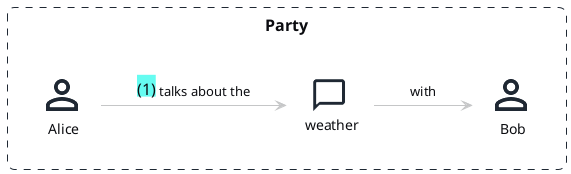

# Domain Storytelling & AI-Assisted DDD Discovery: 2025-2026 Developments

**Date:** 2026-03-23
**Purpose:** Survey recent (2025-2026) developments in Domain Storytelling methodology, AI-assisted DDD discovery, and related tooling to inform alto's conversational discovery design.
**Supplements:** [20260323_1_domain_storytelling_methodology.md](/home/kusanagi/Alty/alty-cli/docs/research/20260323_1_domain_storytelling_methodology.md) (foundational research)

---

## Table of Contents

1. [Executive Summary](#1-executive-summary)
2. [New Publications (2025-2026)](#2-new-publications-2025-2026)
3. [Domain Storytelling as LLM Input](#3-domain-storytelling-as-llm-input-breakthrough-finding)
4. [AI-Assisted Domain Discovery Landscape](#4-ai-assisted-domain-discovery-landscape)
5. [Tooling Updates](#5-tooling-updates)
6. [Text-Based Domain Storytelling Notation](#6-text-based-domain-storytelling-notation)
7. [Remote/Async Domain Storytelling](#7-remoteasync-domain-storytelling)
8. [Conference Activity (2025-2026)](#8-conference-activity-2025-2026)
9. [Spec-Driven Development vs DDD](#9-spec-driven-development-vs-ddd)
10. [Implications for alto](#10-implications-for-alto)
11. [Sources Index](#11-sources-index)

---

## 1. Executive Summary

The 2025-2026 period has seen Domain Storytelling move from a workshop-only technique to a **recognized input format for AI-assisted code generation**. The most significant finding is Annegret Junker's work demonstrating that Domain Storytelling artifacts can be fed directly to LLMs as specification context, with measurable quality improvements when combined with Event Storming output.

Key developments:

- **Domain Storytelling -> LLM pipeline** validated by codecentric (March 2026)
- **Two new books** reference Domain Storytelling as primary discovery technique
- **Egon.io v3.1.0** released March 2026 (still GPLv3)
- **PlantUML DomainStory-PlantUML v0.3.1** is MIT-licensed and text-native
- **Qlerify** is the first commercial AI-DDD tool (Event Storming focused, not DST)
- **Human-in-the-Loop LLM domain modeling** research validates alto's approach
- **DDD Europe 2026** has dedicated AI + Domain Storytelling sessions
- **Spec-Driven Development (BMAD)** is the competitive landscape — and its limitations confirm alto's DDD-first approach

---

## 2. New Publications (2025-2026)

### 2.1 "Mastering Domain-Driven Design" by Annegret Junker (Jan 2025)

**Publisher:** BPB Online (ISBN: 9789365892529)
**Published:** January 31, 2025
**Author:** Annegret Junker, Chief Software Architect at codecentric AG

Covers creating business models using canvases and capability maps, gathering business requirements using Domain Storytelling and visual glossaries, designing macro architecture using Event Storming, and designing services using tactical and API design. Also published a companion "DDD Toolbox" covering the same collaborative modeling techniques.

**Relevance to alto:** This is the first book to position Domain Storytelling explicitly as input for an AI-augmented pipeline (see section 3). The DST -> Event Storming -> OpenAPI pipeline is exactly what alto needs for artifact generation.

**Source:** [Amazon listing](https://www.amazon.com/Mastering-Domain-Driven-Design-Collaborative-storytelling/dp/936589252X)

### 2.2 "Domain-Driven Transformation" by Lilienthal & Schwentner (2026)

**Publisher:** O'Reilly Media (ISBN: 979-8-341-64012-2)
**Published:** 2026
**Authors:** Carola Lilienthal and Henning Schwentner (co-creator of Domain Storytelling)

Domain Storytelling serves as one of the primary design clarification techniques alongside Event Storming and Scenario Casting. The book applies DST to legacy modernization: analyzing business processes, breaking them into bounded contexts, and applying domain-driven refactorings. Introduces the Modularity Maturity Index (MMI) for assessing architectural health and aligning teams with Team Topologies.

**Relevance to alto:** Validates DST for the `alto init --existing` rescue flow. Schwentner's continued investment in DST confirms it as the canonical technique from the original authors.

**Source:** [O'Reilly listing](https://www.oreilly.com/library/view/domain-driven-transformation/9798341640108/), [domain-driven-transformation.com](https://domain-driven-transformation.com/)

### 2.3 "What's the Best Tool?" Article (Updated March 2026)

**Author:** Official domainstorytelling.org (Hofer & Schwentner)
**Updated:** March 16, 2026

Compares three digital tools for Domain Storytelling:

| Tool | Best For | Limitation for alto |
|------|----------|---------------------|
| **Miro template** | Teams already using Miro, occasional modeling | Commercial, visual-only |
| **Egon.io** | Workshop modeling, sentence-by-sentence replay | GPLv3, browser-only |
| **PlantUML** | Documentation, "diagrams as code" | Layout changes distracting for live workshops |

Key insight: The authors explicitly distinguish between **live modeling tools** (Egon, Miro) and **documentation tools** (PlantUML). They acknowledge PlantUML as text-native but say "I would not use it for live modeling in workshops as the sudden changes in layout after every sentence would be distracting."

**Relevance to alto:** alto is neither a live workshop tool nor a pure documentation tool — it is a **conversational discovery tool**. The text-based format fits the CLI interaction model, but alto should define its own format optimized for the AI moderator flow rather than adopting PlantUML syntax directly.

**Source:** [domainstorytelling.org/articles/best-tool/](https://domainstorytelling.org/articles/best-tool/)

---

## 3. Domain Storytelling as LLM Input (Breakthrough Finding)

### 3.1 "From Stories to Code" — Annegret Junker, codecentric (March 2026)

**Published:** March 4, 2026
**Author:** Annegret Junker (codecentric AG)
**URL:** [codecentric.de — From Stories to Code](https://www.codecentric.de/en/knowledge-hub/blog/from-stories-to-code-how-domain-storytelling-and-eventstorming-give-llms-the-context-they-need)

This is the most important finding for alto. Junker demonstrates a three-step pipeline:

```
Domain Storytelling  ->  Event Storming  ->  OpenAPI Spec  ->  LLM Code Generation
```

**Key findings from three iterations:**

| Version | Input Artifacts | LLM Output Quality |
|---------|----------------|-------------------|
| **V1** (Domain Stories only) | Story diagrams with actors, work objects, activities | Missed business rules ("Cook cannot rate own Recipe"), collapsed domain concepts. Schemas had only 3 types. |
| **V2** (+ Event Storming) | Events, commands, policies, read models | Schemas expanded from 3 to 9 types. Added Title, Servings, Meal enums, Diet specifications. Still needed refinement. |
| **V3** (+ Bounded OpenAPI specs) | Machine-readable API contracts per bounded context | Faithful frontend generation without additional instruction. |

**Critical technique:** Rather than transcribing artifacts to text, Junker attached modeling images directly to LLMs with the constraint: *"Do not add any features or concepts not visible in the artifacts."* This keeps the model honest and reveals gaps in domain understanding.

**The headline quote:** "A well-facilitated Domain Storytelling session is the first prompt for your prototype."

**Implications for alto:**
1. Domain Stories alone are necessary but not sufficient — they capture structure but miss business rules and behavioral events
2. The pipeline must continue through Event Storming (or equivalent) to extract events, commands, and policies
3. The Ubiquitous Language — the shared vocabulary from stories — is the actual specification controlling LLM output quality
4. Constraining LLMs to only use concepts from the artifacts prevents hallucination — directly supports alto's Knowledge Trust Hierarchy
5. alto's text-based story format can serve as structured context for LLM-assisted artifact generation

**Source:** [codecentric.de — From Stories to Code](https://www.codecentric.de/en/knowledge-hub/blog/from-stories-to-code-how-domain-storytelling-and-eventstorming-give-llms-the-context-they-need)

### 3.2 Annegret Junker Vienna Meetup (March 25, 2026)

**Event:** "Human-Centered API Design with DDD and AI" at TechTalk Vienna
**Date:** March 25, 2026
**Speaker:** Dr. Annegret Junker

Covered how Domain Storytelling, Event Storming, and Context Mapping converge with OpenAPI and AsyncAPI specifications. Explored how LLMs "amplify human creativity, helping teams transform domain artifacts into executable API contracts while maintaining design intent." Positioned AI as a collaborative tool, not a replacement for thoughtful design.

**Source:** [techtalk.at/meetup-domain-driven-design-ai-25-03/](https://techtalk.at/meetup-domain-driven-design-ai-25-03/)

---

## 4. AI-Assisted Domain Discovery Landscape

### 4.1 Academic Research: Human-in-the-Loop LLM Domain Modeling (2026)

**Paper:** "Towards Human-in-the-Loop LLM-Enabled Domain Modeling"
**Published:** 2026, Springer (LNCS)
**DOI:** [10.1007/978-3-032-08623-5_7](https://link.springer.com/chapter/10.1007/978-3-032-08623-5_7)

Describes an LLM-based modeling approach that combines automatic model creation with human supervision through a feedback loop. The LLM generates an initial draft model from textual descriptions, then a rule-based agent engages the user through Q&A dialogue, selecting questions based on their potential to clarify the most uncertain aspects of the model.

**This is directly parallel to alto's design.** The paper validates the approach of AI-proposes-human-refines through structured dialogue.

**Related finding:** "Automated approaches did not surpass the performance of human experts in tasks such as class identification and association discovery, however, in specific sets of user stories, these tools demonstrated superior performance compared to novices."

**Source:** [Springer — Human-in-the-Loop LLM-Enabled Domain Modeling](https://link.springer.com/chapter/10.1007/978-3-032-08623-5_7)

### 4.2 Academic Research: Impact of LLM-Generated Models on Novice Modelers (2026)

**Paper:** "The impact of LLM-generated models on novice domain modelers"
**Published:** 2026, Empirical Software Engineering journal
**DOI:** [10.1007/s10664-026-10831-5](https://link.springer.com/article/10.1007/s10664-026-10831-5)

LLM-generated domain models help novice modelers but don't replace expert judgment. AI outputs are influenced by hallucinations and inconsistencies, with ambiguities in input text further affecting quality.

**Implication for alto:** Validates alto's target audience (developers who are not DDD experts) — AI-guided discovery provides the most value precisely for this group. Also validates the human-in-the-loop approach: AI proposes, human validates.

### 4.3 Academic Research: Automated Domain Modeling Comparative Study (2023, cited 2025)

**Paper:** "Automated Domain Modeling with Large Language Models: A Comparative Study"
**Published:** IEEE Xplore (10.1109/10344012)

Comprehensive study of using LLMs for fully automated domain modeling from natural language. Found that automated approaches struggle with class identification and association discovery compared to experts. Key insight: LLMs are most useful as a starting point for iteration, not as a final deliverable.

**Source:** [IEEE Xplore](https://ieeexplore.ieee.org/document/10344012/)

### 4.4 Eric Evans' Position on AI + DDD (June 2024)

At a Virtual DDD meetup with Qlerify, Eric Evans (the creator of DDD) stated:

1. **"AI-generated models serve as a powerful starting point"** but require iterative refinement
2. **Generic subdomains work well with AI** while core domains require more human expertise
3. Highlighted **round-trip engineering potential** — bidirectional sync between code and domain models

**Relevance to alto:** Directly supports alto's complexity budget approach — AI handles more in Generic/Supporting subdomains, humans do more in Core subdomains.

**Source:** [Qlerify — Virtual DDD Meetup insights](https://www.qlerify.com/post/insights-from-virtual-ddd-meetup)

### 4.5 Qlerify — Commercial AI-DDD Tool

**Type:** Commercial SaaS (Techstars portfolio company)
**Focus:** Event Storming + Event Modeling (NOT Domain Storytelling)
**AI Engine:** ChatGPT-4o (default, user-selectable)
**Pricing:** Free trial available; commercial pricing not publicly disclosed

Generates domain models from text prompts: Domain Events on a timeline, Command cards, Aggregate Root cards, Entity definitions with fields and example data. Users can input business descriptions and get automated event-driven architecture.

**Limitations compared to alto:**
- Cloud-based SaaS (alto is local-first)
- Event Storming focused, not Domain Storytelling
- No CLI interface
- Commercial/proprietary
- Generates code (alto generates structure/tickets)

**Source:** [qlerify.com](https://www.qlerify.com/domain-driven-design-tool)

---

## 5. Tooling Updates

### 5.1 Egon.io v3.1.0 (March 10, 2026)

**License:** GPLv3 (unchanged — CANNOT embed in alto)
**Latest release:** v3.1.0 (March 10, 2026)
**GitHub stars:** 825+
**Release cadence:** Active, ~2-3 months between releases

Recent features:
- v3.1.0: Color selection for model elements, HTML export improvements
- v3.0.0: Major version bump (April 2025)
- v2.x series: Multiple releases through 2024-2025

**File format:** `.egn` (JSON-based, formerly `.dst`). JSON files are properly formatted, making them suitable for git version control. Import supports `.egn` and `.egn.svg` files.

**Export formats:** SVG (standard and animated), HTML, .egn (JSON). **No text export, no API, no CLI.**

**Relevance to alto:** License remains GPLv3 — cannot embed. However, alto could define its own text format and optionally export to `.egn` JSON for visualization. The lack of text/CLI export from Egon confirms that alto fills a genuine gap in the tooling ecosystem.

**Source:** [github.com/WPS/egon.io/releases](https://github.com/WPS/egon.io/releases), [egon.io/changelog](https://egon.io/changelog)

### 5.2 DomainStory-PlantUML v0.3.1 "Charlie's Quality" (2024)

**License:** MIT (permissive — CAN use in alto)
**Latest stable:** v0.3.1 (available since PlantUML 1.2024.8)
**Author:** Johannes Thorn
**GitHub:** [github.com/johthor/DomainStory-PlantUML](https://github.com/johthor/DomainStory-PlantUML)
**Part of PlantUML Standard Library** since PlantUML v1.2022.5

**Text-based Domain Story syntax:**



**Supported elements:**
- Actors: `Person()`, `Group()`, `System()`
- Work Objects: `Document()`, `Folder()`, `Call()`, `Email()`, `Conversation()`, `Info()`
- Activities: `activity($step, $subject, $predicate, $object[, $preposition, $indirectObject])`
- Boundaries: `Boundary($name) { ... }`
- Auto-numbering, parallel activities, extensible icon set, multiple work objects per sentence

**Relevance to alto:** MIT license means alto could generate PlantUML DST syntax as an optional export format. However, the syntax is designed for diagram generation, not for conversational discovery. alto should define its own simpler text format for the CLI interaction and offer PlantUML export as an optional feature.

**Source:** [github.com/johthor/DomainStory-PlantUML](https://github.com/johthor/DomainStory-PlantUML)

### 5.3 ContextMapper (Updated 2025)

**License:** Apache 2.0 (permissive)
**Type:** DSL + IDE plugin (Eclipse, VS Code)
**Last updated:** Documentation updated October 2025 and March 2025

Provides a Context Mapping Language (CML) for modeling bounded contexts, relationships, aggregates, and events. Supports reverse engineering from Java codebases, architectural refactorings, and code generation (PlantUML diagrams, MDSL service contracts).

**Relevance to alto:** ContextMapper handles the output side (bounded context specification) while Domain Storytelling handles the input side (domain discovery). alto could potentially generate CML as a downstream artifact from discovered bounded contexts.

**Source:** [contextmapper.org](https://contextmapper.org/)

### 5.4 Storystorming (Martin Schimak, 2021)

**License:** N/A (methodology, not software)
**Creator:** Martin Schimak
**Status:** Active concept, last documented update 2021

Combines Domain Storytelling, User Story Mapping, Impact Mapping, Event Storming, Collaboration Modelling, and Example Mapping into one cohesive approach using ten colors of sticky notes. Distinguishes four types of messages: commands (blue), questions (light green), statements (dark green), and notifications about events (orange).

**Relevance to alto:** The four message types could inform alto's fine-grained story analysis — extracting commands, queries, statements, and events from domain stories.

**Source:** [storystorming.com](https://storystorming.com/)

---

## 6. Text-Based Domain Storytelling Notation

### 6.1 Current State of Text Representation

Three text-based representations exist for Domain Storytelling:

| Format | Source | Purpose | Machine-Parseable |
|--------|--------|---------|-------------------|
| **Natural language sentences** | Original methodology | Human communication | Partially (NLP needed) |
| **PlantUML macro syntax** | DomainStory-PlantUML | Diagram generation from code | Yes |
| **Egon .egn JSON** | Egon.io | Tool persistence | Yes |

**None of these are designed for CLI-based conversational discovery.** This is the gap alto fills.

### 6.2 Documentation Artifacts Produced by Domain Storytelling

Based on official sources, a complete Domain Storytelling session produces:

| Artifact | Description | Persistence |
|----------|-------------|-------------|
| **Story diagrams** | Visual narratives with actors, activities, work objects, sequence numbers | .egn file, SVG export, or whiteboard photo |
| **Sentence lists** | Numbered "Actor does Activity using Work Object" sentences | Text (the core portable format) |
| **Actor registry** | List of all actors across stories with their roles | Extracted from stories |
| **Work object inventory** | All work objects with their descriptions | Extracted from stories |
| **Activity verbs** | Domain-language verbs used in activities | Extracted from stories |
| **Annotations** | Business rules, assumptions, variations noted during storytelling | Text callouts on diagrams |
| **Boundary sketches** | Tentative bounded context groupings | Groups in diagrams |
| **Vocabulary / glossary** | Ubiquitous language terms | Built organically from stories |

**Critical insight from domainstorytelling.org:** "The visualization of a domain story is not intended to be a stand-alone document; first and foremost, the picture is for the people who are telling the story while they are telling it, and later, it will serve as a memory aid."

**Implication for alto:** The sentence list (not the diagram) is the portable, machine-processable artifact. alto should capture stories as structured sentences and derive all other artifacts from them.

**Source:** [domainstorytelling.org/quick-start-guide](https://domainstorytelling.org/quick-start-guide), [emmanuelvalverderamos.substack.com](https://emmanuelvalverderamos.substack.com/p/introduction-to-domain-storytelling)

### 6.3 Proposed alto Text Format

Based on all research, alto's domain story format should be:

```
Story: "Customer Orders a Pizza"
Type: coarse-grained, as-is, pure
Trigger: Customer is hungry

Actors:
  - Customer [person]
  - Cashier [person]
  - Kitchen [group]

Work Objects:
  - Menu [document]
  - Order [document]
  - Pizza [item]
  - Receipt [document]

Sentences:
  1. Customer browses Menu
  2. Customer places Order with Cashier
  3. Cashier confirms Order
  4. Cashier sends Order to Kitchen
  5. Kitchen prepares Pizza using Order
  6. Kitchen notifies Cashier that Pizza is ready
  7. Cashier hands Pizza to Customer
  8. Customer pays using Receipt

Annotations:
  - "Only during business hours" [sentence 1]
  - "Payment must be completed before Pizza is handed over" [invariant]

Variations:
  - "Customer cancels Order" -> separate story
  - "Kitchen is out of ingredients" -> separate story
```

This format is:
- Human-readable (domain experts can validate in terminal)
- Machine-parseable (structured TOML/YAML-like)
- Export-capable (can generate PlantUML, .egn JSON)
- Sentence-based (preserves the core DST artifact)
- Annotation-aware (captures business rules inline)

---

## 7. Remote/Async Domain Storytelling

### 7.1 Official Training Context

Domain Storytelling training is offered both online and on-site through DDD Europe and Kalele.io. The methodology has been adapted for remote workshops using Miro and Egon.io.

**Key remote workshop adaptations:**
- Screen-shared Egon.io sessions where the moderator records stories live
- Miro templates with pre-built icon sets for collaborative editing
- Video calls with domain experts narrating while moderator draws

**Source:** [domainstorytelling.org/training](https://domainstorytelling.org/training), [kalele.io/training/domain-storytelling/](https://kalele.io/training/domain-storytelling/)

### 7.2 Gap: No Async/CLI Domain Storytelling Exists

No tool or methodology currently supports asynchronous or CLI-based Domain Storytelling. All current approaches assume:
- Synchronous conversation (live workshop or video call)
- Visual diagramming (whiteboard, Miro, or Egon.io)
- Human moderator (not AI)

**This is alto's unique value proposition.** An AI moderator conducting Domain Storytelling through a CLI conversation — asynchronously, text-based, without visual dependency — is unprecedented in the Domain Storytelling ecosystem.

---

## 8. Conference Activity (2025-2026)

### 8.1 DDD Europe 2026 (June 8-12, Antwerp)

**Domain Storytelling sessions:**

| Session | Speaker(s) | Level | Format |
|---------|-----------|-------|--------|
| Domain Storytelling Workshop (1 day) | Henning Schwentner, Stefan Hofer | Introductory | Pre-conference, June 9 |
| Domain Storytelling in Practice | Henning Schwentner | Introductory | Hands-on Lab |

**AI + DDD sessions:**

| Session | Speaker | Level | Format |
|---------|---------|-------|--------|
| Can AI be a Co-Domain Expert in Domain Modelling? | Philipp Kostyra | Introductory | Hands-on Lab |
| Accelerate Your Strategic Design with LLMs | Thomas Coopman | Intermediate | 2-day Workshop (June 8-9) |
| Human vs Machine | Thomas Coopman | Introductory | Hands-on Lab |

**Source:** [2026.dddeurope.com/program/](https://2026.dddeurope.com/program/)

### 8.2 KanDDDinsky 2026

Call for speakers explicitly seeks sessions on:
- Coding with AI agents while preserving Ubiquitous Language
- RAG systems aligned with Bounded Contexts
- LLMs in collaborative modeling
- Preventing semantic erosion when AI generates code

**Source:** [sessionize.com/kandddinsky-2026/](https://sessionize.com/kandddinsky-2026/)

### 8.3 Explore DDD 2026 (September 21-25, Denver)

Theme: "How AI reshapes software design, modeling, and architecture." Program details forthcoming.

**Source:** [exploreddd.com](https://exploreddd.com/)

### 8.4 Significance

The DDD conference circuit in 2026 has a clear meta-theme: **AI + DDD convergence**. Domain Storytelling remains actively taught by its creators. The "Can AI be a Co-Domain Expert?" session title is essentially asking alto's core question.

---

## 9. Spec-Driven Development vs DDD

### 9.1 BMAD Method — The Competitive Landscape

**What it is:** BMAD (Breakthrough Method for Agile AI-Driven Development) is a framework with 21 specialized AI agents that generate specifications (PRDs, architecture designs, user stories) as the source of truth, then derive code from those specs.

**Key claim:** "Source code is no longer the sole source of truth — documentation is."

**How it relates to alto:** BMAD and alto share the premise that AI coding tools need structured input (not just prompts). Both use multi-agent architectures. BMAD focuses on spec generation; alto focuses on domain discovery.

**Source:** [github.com/bmad-code-org/BMAD-METHOD](https://github.com/bmad-code-org/BMAD-METHOD), [docs.bmad-method.org](https://docs.bmad-method.org/)

### 9.2 The INNOQ Critique (March 2026)

**Article:** "Spec-Driven Development is Domain-Driven Design's Impatient Cousin"
**Published:** March 18, 2026
**Author:** INNOQ (German DDD consultancy)
**URL:** [innoq.com/en/blog/2026/03/sdd-ddd-why-bmad-wont-save-you/](https://www.innoq.com/en/blog/2026/03/sdd-ddd-why-bmad-wont-save-you/)

**Key arguments against Spec-Driven Development:**

1. **"The specification layer depends completely on the quality of domain knowledge the human brings to the interview."** — The tool cannot create domain expertise that doesn't exist.
2. **"A domain model that emerges through implementation and repeated collaboration will capture things no upfront interview process reliably surfaces."** — DDD's continuous discovery is fundamentally different from upfront specification.
3. **"Organizations that struggle with DDD will struggle equally with BMAD."** — Organizational problems precede tool problems.
4. SDD works best for **solo founders** who are simultaneously domain expert, product owner, and developer.

**Implication for alto:** alto sits between SDD and full DDD:
- Like SDD, alto generates specifications before coding
- Like DDD, alto uses Domain Storytelling for genuine domain discovery (not just structured prompting)
- alto's advantage: it guides domain discovery conversation rather than assuming domain knowledge already exists
- alto should acknowledge that its Express mode (~15 min) captures the 80% case, and Deep mode (~60-90 min) captures the nuances

---

## 10. Implications for alto

### 10.1 Validated Design Decisions

| Decision | Validation |
|----------|-----------|
| Domain Storytelling as primary discovery technique | Authors still actively developing (new book 2026, DDD Europe sessions). Community adoption growing. |
| AI moderator role | Human-in-the-Loop LLM research validates AI-proposes-human-refines through structured dialogue |
| Text-based story format | PlantUML DST (MIT) proves text-based stories are viable. No CLI tool exists yet — gap confirmed. |
| Sentence-based capture | Junker's pipeline proves sentences are the portable artifact, not diagrams |
| Knowledge Trust Hierarchy | Evans says generic subdomains work well with AI, core needs human expertise. Matches our hierarchy. |
| DST -> Event Storming pipeline | Junker proves DST alone misses business rules. Need complementary technique. |

### 10.2 New Insights to Incorporate

1. **DST as LLM context:** alto's domain stories should be structured to serve as direct input to LLM-assisted code generation downstream. The format should be machine-readable, not just human-readable.

2. **Constrained generation:** When alto generates artifacts from stories, it should explicitly constrain the LLM: "Only use concepts visible in the domain stories." This prevents hallucination (Junker's technique).

3. **Story quality correlates with output quality:** Junker's V1/V2/V3 progression shows that more artifacts = better LLM output. alto should communicate this to users: "The more stories you tell, the better your project setup will be."

4. **Business rules gap:** DST captures structure (actors, objects, activities) but misses business rules and policies. alto's challenge phase (P1) should focus on extracting invariants, constraints, and policies that DST alone does not surface.

5. **Export to PlantUML DST:** alto should offer optional PlantUML DST export (MIT-licensed library). This lets users visualize their stories with standard tooling.

6. **Export to Egon .egn format:** alto should also offer .egn JSON export for users who want to visualize in Egon.io (user's choice, no GPL code embedded).

### 10.3 Competitive Positioning

| Competitor | Approach | alto Advantage |
|-----------|----------|----------------|
| **BMAD** | Spec-driven, 21 AI agents, docs-as-code | alto does genuine domain discovery, not just structured prompting. DDD-first, not spec-first. |
| **Qlerify** | AI Event Storming, cloud SaaS | alto is local-first, CLI-native, free. Uses DST (lighter than Event Storming) for initial discovery. |
| **Egon.io** | Visual DST modeler | alto is text-based, AI-assisted, generates DDD artifacts. Egon is a drawing tool. |
| **ContextMapper** | DSL for bounded contexts | alto generates the input that ContextMapper consumes. Complementary, not competitive. |

### 10.4 Recommended Follow-Up Work

1. **Define alto's text-based story format** (section 6.3 provides a starting proposal)
2. **Implement PlantUML DST export** using MIT-licensed DomainStory-PlantUML syntax
3. **Implement Egon .egn JSON export** (just JSON serialization, no GPL code)
4. **Research Junker's constrained-generation technique** for artifact generation phase
5. **Design business rules extraction** to complement DST's structural capture
6. **Evaluate ContextMapper CML** as downstream output format for bounded context maps

---

## 11. Sources Index

### Books (2025-2026)

- Junker, Annegret. "Mastering Domain-Driven Design." BPB Online, January 2025. ISBN 9789365892529. [Amazon](https://www.amazon.com/Mastering-Domain-Driven-Design-Collaborative-storytelling/dp/936589252X)
- Junker, Annegret. "DDD Toolbox." BPB Online, 2025. [Amazon](https://www.amazon.com/DDD-Toolbox-Comprehensive-overview-collaborative/dp/9365892740)
- Lilienthal, Carola & Schwentner, Henning. "Domain-Driven Transformation." O'Reilly, 2026. ISBN 979-8-341-64012-2. [O'Reilly](https://www.oreilly.com/library/view/domain-driven-transformation/9798341640108/)

### Articles (2025-2026)

- Junker, Annegret. "From Stories to Code: How Domain Storytelling and EventStorming Give LLMs the Context They Need." codecentric, March 4, 2026. [URL](https://www.codecentric.de/en/knowledge-hub/blog/from-stories-to-code-how-domain-storytelling-and-eventstorming-give-llms-the-context-they-need)
- INNOQ. "Spec-Driven Development is Domain-Driven Design's Impatient Cousin." March 18, 2026. [URL](https://www.innoq.com/en/blog/2026/03/sdd-ddd-why-bmad-wont-save-you/)
- SensioLabs. "Behind the Scenes: 3 Collaborative Ceremonies for Better Development." March 4, 2026. [URL](https://sensiolabs.com/blog/2026/behind-the-scenes-3-collaborative-ceremonies-for-better-development)
- DDD Practitioners. "DDD in the AI-Driven Era." dev.to, February 18, 2025. [URL](https://dev.to/aws-heroes/domain-driven-design-in-ai-driven-era-4l3h)
- domainstorytelling.org. "What's the Best Tool?" Updated March 16, 2026. [URL](https://domainstorytelling.org/articles/best-tool/)

### Academic Papers

- "Towards Human-in-the-Loop LLM-Enabled Domain Modeling." Springer LNCS, 2026. [DOI](https://link.springer.com/chapter/10.1007/978-3-032-08623-5_7)
- "The impact of LLM-generated models on novice domain modelers." Empirical Software Engineering, 2026. [DOI](https://link.springer.com/article/10.1007/s10664-026-10831-5)
- "Automated Domain Modeling with Large Language Models: A Comparative Study." IEEE, 2023. [DOI](https://ieeexplore.ieee.org/document/10344012/)

### Events & Talks

- Qlerify. "Insights from Virtual DDD Meetup" (with Eric Evans). June 5, 2024. [URL](https://www.qlerify.com/post/insights-from-virtual-ddd-meetup)
- Junker, Annegret. "Human-Centered API Design with DDD and AI." TechTalk Vienna, March 25, 2026. [URL](https://techtalk.at/meetup-domain-driven-design-ai-25-03/)
- DDD Europe 2026 Program. June 8-12, Antwerp. [URL](https://2026.dddeurope.com/program/)
- KanDDDinsky 2026 CFP. [URL](https://sessionize.com/kandddinsky-2026/)
- Explore DDD 2026. September 21-25, Denver. [URL](https://exploreddd.com/)

### Tools & Libraries

- Egon.io v3.1.0. GPLv3. [GitHub](https://github.com/WPS/egon.io), [Releases](https://github.com/WPS/egon.io/releases)
- DomainStory-PlantUML v0.3.1. MIT License. [GitHub](https://github.com/johthor/DomainStory-PlantUML)
- ContextMapper. Apache 2.0. [contextmapper.org](https://contextmapper.org/)
- Qlerify. Commercial. [qlerify.com](https://www.qlerify.com/)
- BMAD Method. [GitHub](https://github.com/bmad-code-org/BMAD-METHOD), [Docs](https://docs.bmad-method.org/)

### Methodologies

- Storystorming (Martin Schimak). [storystorming.com](https://storystorming.com/)
- Domain Storytelling official. [domainstorytelling.org](https://domainstorytelling.org/)
- awesome-domain-storytelling (archived July 2024, moved to domainstorytelling.org/resources). [GitHub](https://github.com/hofstef/awesome-domain-storytelling)
